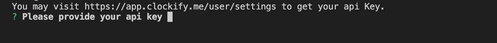

# TimeKeeper
Repository for team TimeKeeper's project

# Timesheet Automation
https://www.npmjs.com/package/timesheet-automation?activeTab=readme

This package helps users to track their time on projects and tasks. It uses the Clockify API to track and store the data. Functions include starting a timer, stopping a timer, and exporting timesheets in an Excel file.

## Setup & Installation

- Clockify API key is required. Please obtain the API key from https://app.clockify.me/tracker. 
- To install Timesheet Automation, simply run the following command in the terminal:

`` npm i -g timesheet-automation ``

*if the terminal requires your permission to access the folder, use ``sudo npm i -g timesheet-automation ``.

## Usage

1. Start the program

`` timer ``
*if the error message 'permission denied' returns, use `` sudo timer ``.

2. Provide your API key from Clockify when first use.

 width="400px"

3. Use arrow keys to select 'Start a New Timer' from your menu.

4. Select 'New Project' and enter a name.

5. Select 'New Task' and enter a name.

6. Enter the brief description of the task if you want.

7. The timer has been started.

8. Press any key to stop the timer.

9. Select 'Check Projects List' to read the duration of time counted.

10. Select 'Export Timesheet to Excel File' to read all the details from different tasks and projects.

11. The Excel File is generated and stored at your Download folder. Time details from different projects are stored in the spreadsheets seperately. 

